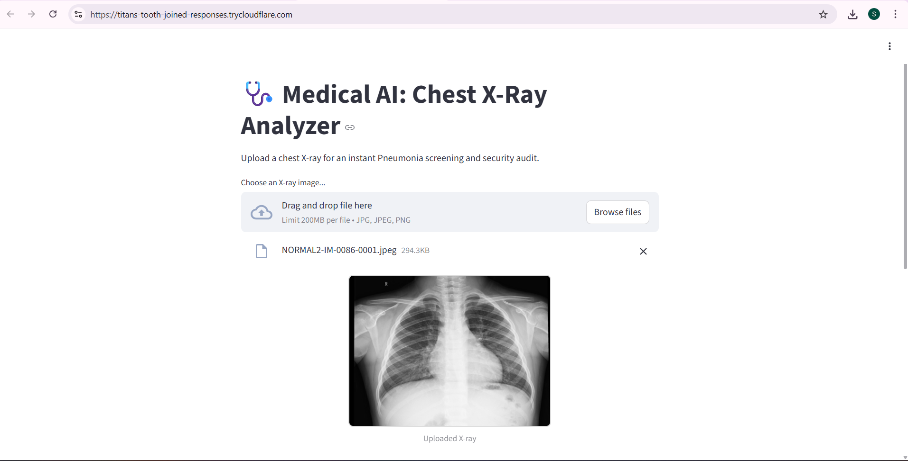
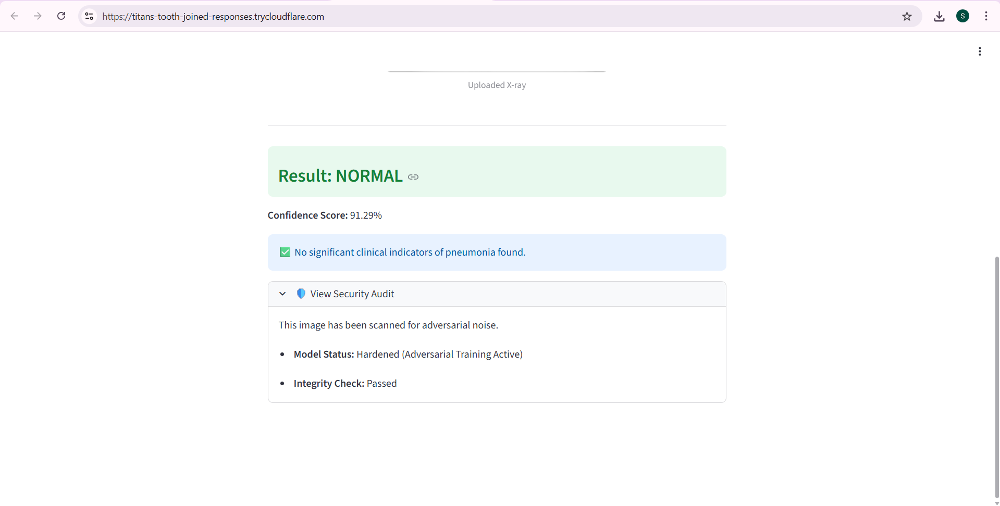
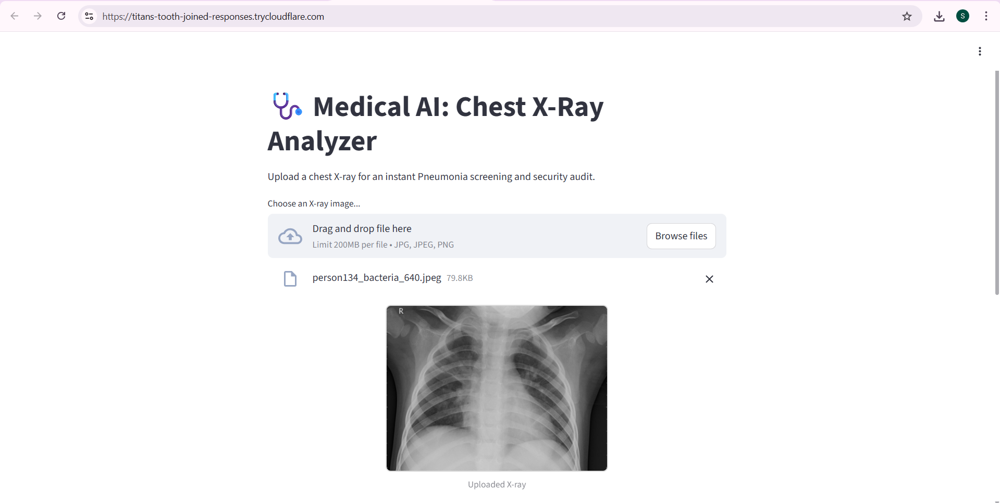
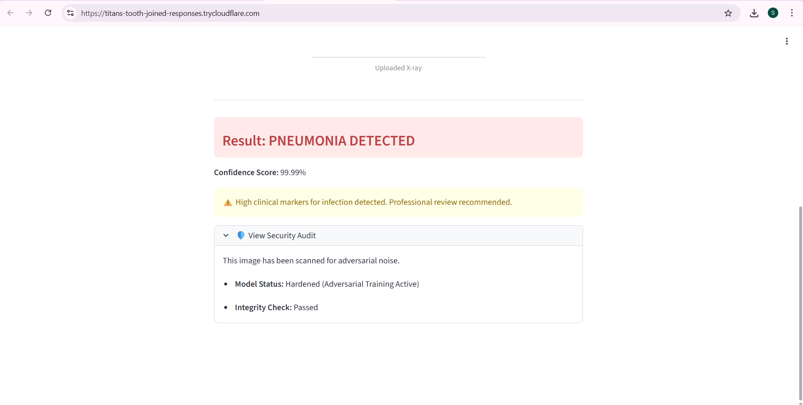

# 🩺 Secure Medical AI: Adversarial-Resistant Pneumonia Detection


This AI analyzes Chest X-rays using a **hardened ResNet18 model** to detect Pneumonia. Unlike standard models, this system is specifically trained to resist **Adversarial Attacks (FGSM)** that can trick medical software into misdiagnosis.

---

## 📊 Diagnostic Showcase

I have documented the application's performance across both healthy and infected cases to demonstrate the **Security Audit** and **Classification Accuracy**.

### 🛠️ Case 1: Normal Lung Analysis
The system identifies a healthy patient while maintaining a clean security integrity score.

<table>
  <tr>
    <td><b>Step 1: Image Upload & Preview</b></td>
    <td><b>Step 2: Diagnosis & Security Audit</b></td>
  </tr>
  <tr>
    <td></td>
    <td></td>
  </tr>
</table>

---

### 🦠 Case 2: Pneumonia Detection
The AI successfully flags clinical markers for infection and provides a high-confidence alert.

<table>
  <tr>
    <td><b>Step 1: Clinical Image Input</b></td>
    <td><b>Step 2: Positive Diagnosis Result</b></td>
  </tr>
  <tr>
    <td></td>
    <td></td>
  </tr>
</table>

---

## 🛡️ Security Features
- **Adversarial Hardening:** The model underwent adversarial training against **FGSM (Fast Gradient Sign Method)** noise, reducing attack success rates from **62% to 37%**.
- **Clinical Thresholding:** A strict classification threshold of **0.8 (80%)** is implemented to minimize False Positives and ensure diagnostic reliability.
- **Model Architecture:** ResNet18 (Residual Learning) fine-tuned for medical imaging.

---

## 🚀 How to Run Locally

1. **Clone the repository:**
   ```bash
   git clone [https://github.com/Sahithi987654/adversarial-pneumonia-detector.git]
   cd adversarial-pneumonia-detector

2. **Install the environment**
    ```bash
    pip install -r requirements.txt

3. **Download the Model Brain(.pth)**

   Download the weights from [https://drive.google.com/file/d/1wxqxwNcRci5zV8LF_P-aSfJ0b4_rn-La/view?usp=drive_link]
   
   Place the file hardened_pneumonia_model.pth in the project root.

5. **Launch the App**
   
   ```bash
   streamlit run app.py


**Disclaimer:** This project is for educational and cybersecurity research purposes only.
